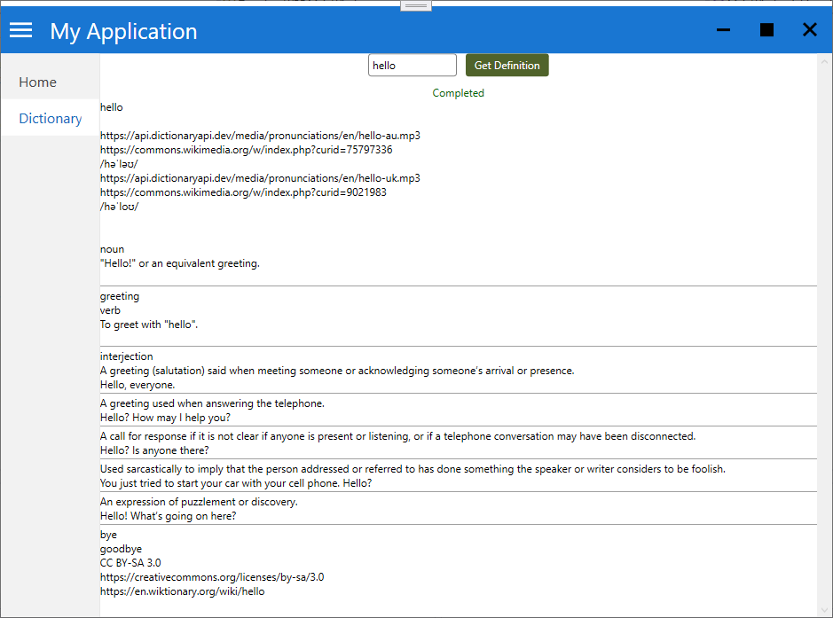

# Template

WPF App Template: A WPF application featuring a Hamburger menu, Entity Framework, Dependency Injection via Microsoft Hosting, Web API consumption, and MVVM design pattern.

Sample Dictionary Application.

For database migration, set Template.Domain as the Default Project in the Package Manager Console and execute:
Add-Migration InitialCreate
Update-Database

[Entity Framework documentation](https://learn.microsoft.com/en-us/ef/core/managing-schemas/migrations/?tabs=vs)

Register and log in to access the Hamburger menu and Dictionary search functionality.

Thanks [@SingletonSean](https://github.com/SingletonSean)
